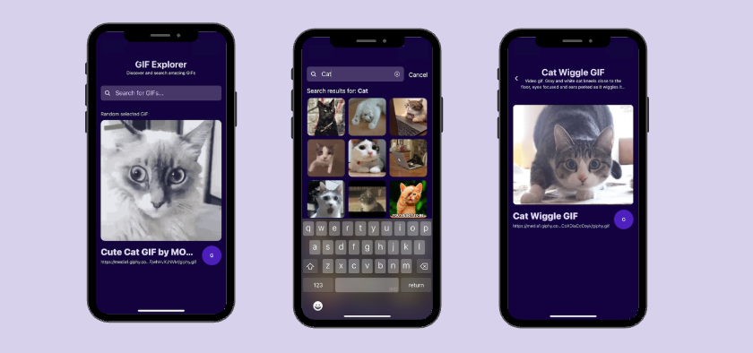
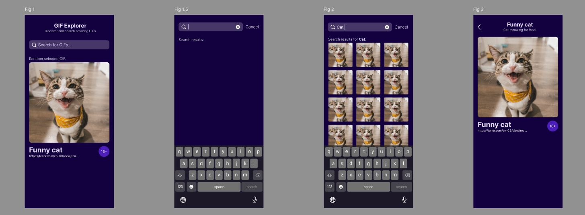

# Welcome to the GIF App 

## Screenshots
The app will automatically show a random GIF on home page that will change every 10 seconds. 
Through search bar, you can search for any GIF you want and by clicking on any GIF, you can view the detail of the GIF.


> *Author's Note:*
> 
> I really enjoyed working on this project with React Native and I hope you will like it too! Thanks for this opportunity. Michaela :)



## Get started

1. Install dependencies

   ```bash
   npm install
   ```

2. Start the app

   ```bash
   npx expo start
   ```

In the output, you'll find options to open the app in a

- [development build](https://docs.expo.dev/develop/development-builds/introduction/)
- [Android emulator](https://docs.expo.dev/workflow/android-studio-emulator/)
- [iOS simulator](https://docs.expo.dev/workflow/ios-simulator/)
- [Expo Go](https://expo.dev/go), a limited sandbox for trying out app development with Expo

Note: The app was developed with use of Expo Go app on a physical device - iPhone 13 mini.

Another scripts:
- `npm run lint` - runs linter
- `npm run format` - formats code with Prettier
- `npm run test` - runs unit tests
- `npm run test:cov` - runs unit tests with coverage report

## Architecture

The app was developed with [Expo](https://expo.dev/) and [React Native](https://reactnative.dev/), using [TypeScript](https://www.typescriptlang.org/) as the programming language (as specified in the assignment).

**Expo** was chosen, because it is the official framework for React Native and allows easy development and testing on physical devices without need of setting up simulators.

**[Tailwind](https://tailwindcss.com/) ([Nativewind](https://www.nativewind.dev/))** was used for styling, as it allows quick and responsive design.

**[Giphy API](https://developers.giphy.com/)** was used for fetching GIFs (as mentioned in instructions). The API key is stored in `.env.development`.

### App structure
The app consists of **three screens** and **several reusable components**.

I consider using the **dynamic routing** for navigation between search screen and GIF detail screen (with `app/gif/[id].tsx`). However, since the GIF data are already in the search result, I wanted to **avoid refetching**. I created `GifMinimalObject` and with that we pass through the `useLocalSearchParams` only needed information and not whole GIF object. 

**`Expo-image`** has to be used for displaying the animated GIF, as the standard `Image` component doesn't support animated images. I am using standard `Image` component in search results, they are not animated.

One **custom hook** was created - `useFetch` for fetching data from Giphy API. It handles loading, error states and data. It can be reused for different endpoints.

### AI
I tried not to used AI tools for generating blocks of code, but mainly for troubleshooting with concrete problems. I really wanted to deep dive into React Native. 

There are two exceptions:
- I used ChatGPT to generate TypeScript type GifObject from Giphy API website
- I used AI to help me a lot with writing unit tests based on my descriptions like "It should test that the error shows 'Unexpected error' if no message given"

## Third-party libraries

Next to the classic React Native, Expo, Prettier and Lint libraries, I used:
- `@expo/vector-icons` for icons as it is recommended by Expo
- `dotenv` for loading environment variables
- `nativewind` and `tailwind` for styling with Tailwind CSS
- `jest` and `@testing-library/react-native` for unit tests
- (not a library) [Conventional Commits](https://www.conventionalcommits.org/en/v1.0.0/) specification was used, it gives clear and simple way of writing commit messages

## Tests

Unit tests were created with [Jest](https://jestjs.io/) and [React Native Testing Library](https://testing-library.com/docs/react-native-testing-library/intro/).

The app was tested on physical iPhone 13 mini and Google Pixel 4a device with Expo Go app. No simulators were used.

## Visual

First mock of the app was created with [Figma Make AI](https://www.figma.com/make/clVE1tIeOPLGwMCDseom5l/GIF-Viewer-App?node-id=0-1&t=c55LssaXkLUy0Vqt-1) to get better idea of the app.

Then, I created the final design that match the assignment wireframes specification in [Figma](https://www.figma.com/design/Jvoj8GlMgHV3J2ibBtGHnF/GIF-app?node-id=0-1&t=PeC4ljahwYjudfQZ-1).

